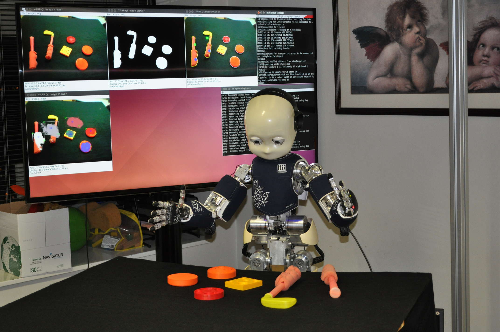

# Robot Affordances

Software for learning visual robot affordances.



## Introduction

This website illustrates a software framework for experiments in visual robot affordances. It is directed at the robotics, psychophysics and neuroscience communities. We provide documentation and tutorials of some practical applications.

The pipeline of the framework is as follows. 1) A visual segmentation algorithm is run on an image stream; 2) features of the segmented objects and of their constituent parts (e.g., effector and handle of tools) are extracted; 3) the features are then used for higher-level inference and for reasoning about object affordances. Complete examples are provided.

To run the first two steps, please launch [this script](https://github.com/robotology/poeticon/blob/master/app/scripts/segmentation.xml.template) from the POETICON++ project repository. To train an affordance knowledge base, launch [affordancesExploration](https://github.com/robotology/poeticon/blob/master/app/scripts/affordancesExploration.xml.template). Finally, to make inference queries about the learned affordance knowledge, follow the instructions in [this page](https://github.com/robotology/poeticon/tree/master/src/affNetwork).

## Tutorials & Documentation

Dependencies:

- [YARP](https://github.com/robotology/yarp)
- [icub-contrib-common](https://github.com/robotology/icub-contrib-common)
- [OpenCV](http://opencv.org/downloads.html)

Installation in Linux:

```
git clone https://github.com/gsaponaro/robot-affordances
cd robot-affordances && mkdir build && cd build && cmake .. && make
```

Online documentation is available here: [https://gsaponaro.github.io/robot-affordances/](https://gsaponaro.github.io/robot-affordances/).

## Publications

* Giovanni Saponaro, Alexandre Antunes, Rodrigo Ventura, Lorenzo Jamone, Alexandre Bernardino. *Combining Affordance Perception and Probabilistic Planning for Robust Problem Solving in a Cognitive Robot*. Under review.
* Giovanni Saponaro, Pedro Vicente, Atabak Dehban, Lorenzo Jamone, Alexandre Bernardino, José Santos-Victor. *Learning at the Ends: From Hand to Tool Affordances in Humanoid Robots*. IEEE International Conference on Developmental and Learning and on Epigenetic Robotics (ICDL-EpiRob 2017).
* Alexandre Antunes, Giovanni Saponaro, Anthony Morse, Lorenzo Jamone, José Santos-Victor, Angelo Cangelosi. *Learn, Plan, Remember: A Developmental Robot Architecture for Task Solving*. IEEE International Conference on Developmental and Learning and on Epigenetic Robotics (ICDL-EpiRob 2017).
* Alexandre Antunes, Lorenzo Jamone, Giovanni Saponaro, Alexandre Bernardino, Rodrigo Ventura. *From Human Instructions to Robot Actions: Formulation of Goals, Affordances and Probabilistic Planning*. IEEE International Conference on Robotics and Automation (ICRA 2016).
* Afonso Gonçalves, João Abrantes, Giovanni Saponaro, Lorenzo Jamone, Alexandre Bernardino. *Learning Intermediate Object Affordances: Towards the Development of a Tool Concept*. IEEE International Conference on Development and Learning and on Epigenetic Robotics (ICDL-EpiRob 2014).
* Afonso Gonçalves, Giovanni Saponaro, Lorenzo Jamone, Alexandre Bernardino. *Learning Visual Affordances of Objects and Tools through Autonomous Robot Exploration*. IEEE International Conference on Autonomous Robot Systems and Competitions (ICARSC 2014).

## Other publications that use our framework

* Atabak Dehban, Lorenzo Jamone, Adam R. Kampff, José Santos-Victor. *Denoising Auto-Encoders for Learning of Objects and Tools Affordances in Continuous Space*. IEEE International Conference on Robotics and Automation (ICRA 2016).
* Anthony F. Morse, Angelo Cangelosi. *Why Are There Developmental Stages in Language Learning? A Developmental Robotics Model of Language Development*. Cognitive Science, 2016.

## License

Released under the terms of the GPL v2.0 or later. See the file LICENSE for details.
